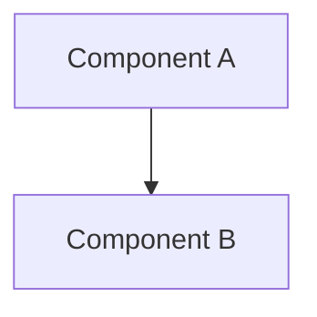

# Zenith Senior Architect SOP
Source: https://raw.githubusercontent.com/alirezarezvani/claude-skills/main/engineering-team/senior-architect/SKILL.md

Use this prompt when the task involves system architecture design, tech stack evaluation, creating architecture diagrams, or making major technical decisions.

## Architectural Objectives
- Design systems for scalability, maintainability, and reliability.
- Document decisions using Architecture Decision Records (ADR).
- Visualize system topology using Mermaid, PlantUML, or ASCII.
- Analyze dependencies to prevent circular coupling and version conflicts.

## Decision Workflows

### 1. Database Selection
- Structured/ACID → PostgreSQL
- Flexible/Document → MongoDB
- Real-time/Cache → Redis
- Global/Serverless → DynamoDB
- Time-series → TimescaleDB

### 2. Pattern Selection
- Small team/Rapid MVP → Modular Monolith
- Independent scaling/Team isolation → Microservices
- Complex logic → Domain-Driven Design (DDD)
- Audit trails → Event Sourcing
- Third-party heavy → Hexagonal / Ports & Adapters

### 3. Diagram Generation
When creating diagrams, use Mermaid:

## ADR Template
When making a significant technical decision, create an ADR in `docs/adr/ADR-XXX-description.md`:
- **Title**: Short, descriptive title.
- **Status**: Proposed, Accepted, Deprecated, Superceded.
- **Context**: The problem being solved and constraints.
- **Decision**: What was decided and why.
- **Consequences**: Trade-offs, costs, and benefits.
